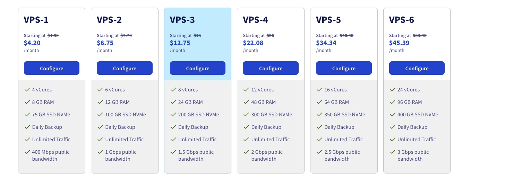

# Containerlab - The Anti-Pattern

*An intellectual is a man who says a simple thing in a diffcut way; an artist is a man who says a difficult thing in a simple way.* - Charles Bukowski - Notes of a Dirty Old Man, 1969

In a world where technology seems to be working against us and seemingly simple things require far more effort than expected and warranted, Nokia's containerlabs give us a little art with our technology.  

Already making spinning up labs nearly efforless and fully automation friendly, its no surprise the Roman Dodin's containerlab team has gone a step further.

How about spinning up a lab right from its GitHub repository?

Network Engineers, there is no longer any excuse for not testing!

Lets take a look.

### Environment

My containerlab environment is on a VPS-3 VM running on [OVHcloud](https://us.ovhcloud.com) (Very cost effective as you see!)




## Deploying Locally

I have a mock up of a [data center topology in Seattle in a public GitHub repository](https://github.com/cldeluna/clab_sea_datacenter).  

Normally I would clone the repository and deploy the topology.  

```bash
laudia@vps-ovh:~/containerlab$ git clone https://github.com/cldeluna/clab_sea_datacenter.git
Cloning into 'clab_sea_datacenter'...
remote: Enumerating objects: 10, done.
remote: Counting objects: 100% (10/10), done.
remote: Compressing objects: 100% (7/7), done.
remote: Total 10 (delta 3), reused 10 (delta 3), pack-reused 0 (from 0)
Receiving objects: 100% (10/10), 5.34 KiB | 5.34 MiB/s, done.
Resolving deltas: 100% (3/3), done.
claudia@vps-ovh:~/containerlab$ cd clab_sea_datacenter/
```

Say my teammate had made updates, i would `git pull`, and then `clab deploy`.

```bash
claudia@vps-ovh:~/containerlab/clab_sea_datacenter$ git pull origin main
From https://github.com/cldeluna/clab_sea_datacenter
 * branch            main       -> FETCH_HEAD
Already up to date.

claudia@vps-ovh:~/containerlab/clab_sea_datacenter$ clab deploy --reconfigure
```

Absolutly nothing wrong with this workflow and there are many use cases where you will continue to use this workflow.

In my environment, deploying the lab locally took **1m9.096s**.


## Deploying the topology via the GitHub URL

I don't have time for all this cloning stuff!

I have created a "github-labs" directory and I run all of my "remote" topologies in there.


```bash
claudia@vps-ovh:~/containerlab/github-lab$ clab deploy -t https://github.com/cldeluna/clab_sea_datacenter
19:38:47 INFO Containerlab started version=0.70.1
19:38:47 INFO Parsing & checking topology file=sea_datacenter.clab.yml
19:38:47 INFO Creating docker network name=clab IPv4 subnet=172.20.20.0/24 IPv6 subnet=3fff:172:20:20::/64 MTU=0
19:38:47 INFO Creating lab directory path=/home/claudia/containerlab/github-lab/clab_sea_datacenter/clab-dc1
19:38:48 INFO Creating container name=sea-dc-host4
19:38:48 INFO Creating container name=sea-dc-host2
19:38:48 INFO Creating container name=sea-dc-host5
19:38:48 INFO Creating container name=sea-dc-host1
19:38:48 INFO Creating container name=sea-dc-spine1
19:38:48 INFO Creating container name=sea-dc-spine2
19:38:48 INFO Creating container name=sea-dc-leaf4
19:38:48 INFO Creating container name=sea-dc-host3
19:38:48 INFO Creating container name=sea-dc-leaf1
19:38:48 INFO Creating container name=sea-dc-leaf2
19:38:48 INFO Creating container name=sea-dc-leaf3
19:38:48 INFO Creating container name=sea-dc-host7
19:38:48 INFO Created link: sea-dc-spine1:eth1 ▪┄┄▪ sea-dc-spine2:eth1
19:38:49 INFO Created link: sea-dc-spine1:eth6 ▪┄┄▪ sea-dc-spine2:eth6
19:38:49 INFO Creating container name=sea-dc-host6
...
```

Now in my "github-labs" directory I have a new directory for this remote topology.

```bash
claudia@vps-331cdbb4:~/containerlab/github-lab$ ls
clab_sea_datacenter
```

```bash
claudia@vps-331cdbb4:~/containerlab$ tree github-lab/ -L 2
github-lab/
└── clab_sea_datacenter
    ├── README.md
    ├── clab-dc1
    ├── sea-dc-leaf1-config.txt
    ├── sea-dc-leaf2-config.txt
    ├── sea-dc-leaf3-config.txt
    ├── sea-dc-leaf4-config.txt
    ├── sea-dc-spine1-config.txt
    ├── sea-dc-spine2-config.txt
    └── sea_datacenter.clab.yml

2 directories, 8 files
```

That directory is in fact a clone.  

```bash
claudia@vps-331cdbb4:~/containerlab/github-lab/clab_sea_datacenter$ git remote -v
origin  https://github.com/cldeluna/clab_sea_datacenter (fetch)
origin  https://github.com/cldeluna/clab_sea_datacenter (push)
```


In my environment, deploying the lab via the repo URL took **1m9.967s**.

I can live with 871 milliseconds slower and that is assuming you are manually interacting with the lab.  Think of the power of this in your automated workflows!

#### A few considerations

I executed my deploy command from the "github-lab" directory.  

Keep in mind that when working locally you have a local topology file ( *.clab.yml or *.clab.yaml ) and your clab commands are optimized so you can use shortcuts like `clab inspect` and `clab destroy` if you are working in your topology directory.  

My topology directory "github-lab" has no topoloty file so those commands will fail.

```bash
claudia@vps-331cdbb4:~/containerlab/github-lab$ clab destroy --cleanup
          
   ERROR  
          
  No topology files matching the pattern *.clab.yml or *.clab.yaml found.                                             

```


Simply move into the newly created topology directory and you an resume your usual workflow.

Alternatively, use the broader comands (if this is the only lab you have up)

This lets you insepct all your labs.

```bash
clab inspect --all
```

This lets you shut down all your labs (without prompting).

```bash
clab destroy -a -y 
```

Note: when using `-a`, the `--cleanup` option will not remove all the lab directories (this is documented behavior). 


The only thing easier than containerlab, if you want quick fully formed topologies, is netlab from ipSpace and guess what?  Net lab also supports URL deployment.     So ive got the next topic to investigate all lined up.


### My containerlab cheat sheet

I need to spin up a local topology

```bash
# cd <to the directory with your xxx.clab.yml (or xxx.clab.yaml) topology file>
clab deploy
```

I need to spin up a topology from a github repository

```bash
 # cd <to the directory where you want to lab items created>
clab deploy --topo https://github.com/cldeluna/clab_sea_datacenter/blob/main/sea_datacenter.clab.yml
```

What labs are running?

```bash
clab inspect --all 
```

I need to shut it all down!

```bash
clab destroy -a -y --cleanup
```

I have a lingering topology with a status of `exit`.
```
 docker container prune
```

I need to shut down a specific topology.

```bash
clab destroy -t topology.clab.yaml -y --cleanup
```


---


### Launching from GitHub Repo URL

```bash
claudia@vps-ovh:~$ time containerlab deploy --topo https://github.com/cldeluna/clab_sea_datacenter/blob/main/sea_datacenter.clab.yml
17:24:52 INFO Containerlab started version=0.70.1

...

17:26:02 INFO Adding host entries path=/etc/hosts
17:26:02 INFO Adding SSH config for nodes path=/etc/ssh/ssh_config.d/clab-dc1.conf
🎉 A newer containerlab version (0.70.2) is available!
Release notes: https://containerlab.dev/rn/0.70/#0702
Run 'sudo clab version upgrade' or see https://containerlab.dev/install/ for installation options.
╭────────────────────────┬───────────────┬─────────┬───────────────────╮
│          Name          │   Kind/Image  │  State  │   IPv4/6 Address  │
├────────────────────────┼───────────────┼─────────┼───────────────────┤
│ clab-dc1-sea-dc-host1  │ linux         │ running │ 172.20.20.107     │
│                        │ alpine:latest │         │ 3fff:172:20:20::2 │
├────────────────────────┼───────────────┼─────────┼───────────────────┤
│ clab-dc1-sea-dc-host2  │ linux         │ running │ 172.20.20.108     │
│                        │ alpine:latest │         │ 3fff:172:20:20::7 │
├────────────────────────┼───────────────┼─────────┼───────────────────┤
│ clab-dc1-sea-dc-host3  │ linux         │ running │ 172.20.20.109     │
│                        │ alpine:latest │         │ 3fff:172:20:20::a │
├────────────────────────┼───────────────┼─────────┼───────────────────┤
│ clab-dc1-sea-dc-host4  │ linux         │ running │ 172.20.20.110     │
│                        │ alpine:latest │         │ 3fff:172:20:20::b │
├────────────────────────┼───────────────┼─────────┼───────────────────┤
│ clab-dc1-sea-dc-host5  │ linux         │ running │ 172.20.20.111     │
│                        │ alpine:latest │         │ 3fff:172:20:20::5 │
├────────────────────────┼───────────────┼─────────┼───────────────────┤
│ clab-dc1-sea-dc-host6  │ linux         │ running │ 172.20.20.112     │
│                        │ alpine:latest │         │ 3fff:172:20:20::c │
├────────────────────────┼───────────────┼─────────┼───────────────────┤
│ clab-dc1-sea-dc-host7  │ linux         │ running │ 172.20.20.113     │
│                        │ alpine:latest │         │ 3fff:172:20:20::d │
├────────────────────────┼───────────────┼─────────┼───────────────────┤
│ clab-dc1-sea-dc-leaf1  │ ceos          │ running │ 172.20.20.103     │
│                        │ ceos:latest   │         │ 3fff:172:20:20::8 │
├────────────────────────┼───────────────┼─────────┼───────────────────┤
│ clab-dc1-sea-dc-leaf2  │ ceos          │ running │ 172.20.20.104     │
│                        │ ceos:latest   │         │ 3fff:172:20:20::e │
├────────────────────────┼───────────────┼─────────┼───────────────────┤
│ clab-dc1-sea-dc-leaf3  │ ceos          │ running │ 172.20.20.105     │
│                        │ ceos:latest   │         │ 3fff:172:20:20::6 │
├────────────────────────┼───────────────┼─────────┼───────────────────┤
│ clab-dc1-sea-dc-leaf4  │ ceos          │ running │ 172.20.20.106     │
│                        │ ceos:latest   │         │ 3fff:172:20:20::4 │
├────────────────────────┼───────────────┼─────────┼───────────────────┤
│ clab-dc1-sea-dc-spine1 │ ceos          │ running │ 172.20.20.101     │
│                        │ ceos:latest   │         │ 3fff:172:20:20::9 │
├────────────────────────┼───────────────┼─────────┼───────────────────┤
│ clab-dc1-sea-dc-spine2 │ ceos          │ running │ 172.20.20.102     │
│                        │ ceos:latest   │         │ 3fff:172:20:20::3 │
╰────────────────────────┴───────────────┴─────────┴───────────────────╯

real    1m9.967s
user    0m0.008s
sys     0m0.004s
```


### Launching locally from cloned repo

```bash
laudia@vps-ovh:~/containerlab$ git clone https://github.com/cldeluna/clab_sea_datacenter.git
Cloning into 'clab_sea_datacenter'...
remote: Enumerating objects: 10, done.
remote: Counting objects: 100% (10/10), done.
remote: Compressing objects: 100% (7/7), done.
remote: Total 10 (delta 3), reused 10 (delta 3), pack-reused 0 (from 0)
Receiving objects: 100% (10/10), 5.34 KiB | 5.34 MiB/s, done.
Resolving deltas: 100% (3/3), done.
claudia@vps-ovh:~/containerlab$ cd clab_sea_datacenter/

```


```bash

claudia@vps-ovh:~/containerlab/clab_sea_datacenter$ time clab deploy
17:29:03 INFO Containerlab started version=0.70.1
17:29:03 INFO Parsing & checking topology file=sea_datacenter.clab.yml

...

17:30:11 INFO Adding host entries path=/etc/hosts
17:30:11 INFO Adding SSH config for nodes path=/etc/ssh/ssh_config.d/clab-dc1.conf
🎉 A newer containerlab version (0.70.2) is available!
Release notes: https://containerlab.dev/rn/0.70/#0702
Run 'sudo clab version upgrade' or see https://containerlab.dev/install/ for installation options.
╭────────────────────────┬───────────────┬─────────┬───────────────────╮
│          Name          │   Kind/Image  │  State  │   IPv4/6 Address  │
├────────────────────────┼───────────────┼─────────┼───────────────────┤
│ clab-dc1-sea-dc-host1  │ linux         │ running │ 172.20.20.107     │
│                        │ alpine:latest │         │ 3fff:172:20:20::6 │
├────────────────────────┼───────────────┼─────────┼───────────────────┤
│ clab-dc1-sea-dc-host2  │ linux         │ running │ 172.20.20.108     │
│                        │ alpine:latest │         │ 3fff:172:20:20::a │
├────────────────────────┼───────────────┼─────────┼───────────────────┤
│ clab-dc1-sea-dc-host3  │ linux         │ running │ 172.20.20.109     │
│                        │ alpine:latest │         │ 3fff:172:20:20::b │
├────────────────────────┼───────────────┼─────────┼───────────────────┤
│ clab-dc1-sea-dc-host4  │ linux         │ running │ 172.20.20.110     │
│                        │ alpine:latest │         │ 3fff:172:20:20::9 │
├────────────────────────┼───────────────┼─────────┼───────────────────┤
│ clab-dc1-sea-dc-host5  │ linux         │ running │ 172.20.20.111     │
│                        │ alpine:latest │         │ 3fff:172:20:20::5 │
├────────────────────────┼───────────────┼─────────┼───────────────────┤
│ clab-dc1-sea-dc-host6  │ linux         │ running │ 172.20.20.112     │
│                        │ alpine:latest │         │ 3fff:172:20:20::7 │
├────────────────────────┼───────────────┼─────────┼───────────────────┤
│ clab-dc1-sea-dc-host7  │ linux         │ running │ 172.20.20.113     │
│                        │ alpine:latest │         │ 3fff:172:20:20::2 │
├────────────────────────┼───────────────┼─────────┼───────────────────┤
│ clab-dc1-sea-dc-leaf1  │ ceos          │ running │ 172.20.20.103     │
│                        │ ceos:latest   │         │ 3fff:172:20:20::8 │
├────────────────────────┼───────────────┼─────────┼───────────────────┤
│ clab-dc1-sea-dc-leaf2  │ ceos          │ running │ 172.20.20.104     │
│                        │ ceos:latest   │         │ 3fff:172:20:20::e │
├────────────────────────┼───────────────┼─────────┼───────────────────┤
│ clab-dc1-sea-dc-leaf3  │ ceos          │ running │ 172.20.20.105     │
│                        │ ceos:latest   │         │ 3fff:172:20:20::4 │
├────────────────────────┼───────────────┼─────────┼───────────────────┤
│ clab-dc1-sea-dc-leaf4  │ ceos          │ running │ 172.20.20.106     │
│                        │ ceos:latest   │         │ 3fff:172:20:20::3 │
├────────────────────────┼───────────────┼─────────┼───────────────────┤
│ clab-dc1-sea-dc-spine1 │ ceos          │ running │ 172.20.20.101     │
│                        │ ceos:latest   │         │ 3fff:172:20:20::c │
├────────────────────────┼───────────────┼─────────┼───────────────────┤
│ clab-dc1-sea-dc-spine2 │ ceos          │ running │ 172.20.20.102     │
│                        │ ceos:latest   │         │ 3fff:172:20:20::d │
╰────────────────────────┴───────────────┴─────────┴───────────────────╯

real    1m9.096s
user    0m0.007s
sys     0m0.006s
```


---


_Data Center Leaf/Spine topology, VXLAN, MLAG, BGP underlay_

**Configure Apline Hosts**

  sea-dc-host1

     docker exec -it clab-dc1-sea-dc-host1 sh
     apk update
     apk add net-tools iproute2 iputils-ping
     ifconfig eth1 10.110.0.101 netmask 255.255.255.0
     route add -net 0.0.0.0 netmask 0.0.0.0 gw 10.110.0.1 dev eth1
     ping -i 30 10.110.0.102

  sea-dc-host2

     docker exec -it clab-dc1-sea-dc-host2 sh
     apk update
     apk add net-tools iproute2 iputils-ping
     ifconfig eth1 10.130.0.101 netmask 255.255.255.0
     route add -net 0.0.0.0 netmask 0.0.0.0 gw 10.130.0.1 dev eth1
     ping -i 30 10.130.0.102

  sea-dc-host3

     docker exec -it clab-dc1-sea-dc-host3 sh
     apk update
     apk add net-tools iproute2 iputils-ping
     ifconfig eth1 10.110.0.101 netmask 255.255.255.0
     route add -net 0.0.0.0 netmask 0.0.0.0 gw 10.110.0.1 dev eth1
     ping -i 30 10.110.0.102

  sea-dc-host4

     docker exec -it clab-dc2-sea-dc-host4 sh
     apk update
     apk add net-tools iproute2 iputils-ping
     ifconfig eth1 10.130.0.102 netmask 255.255.255.0
     route add -net 0.0.0.0 netmask 0.0.0.0 gw 10.130.0.1 dev eth1
     ping -i 30 10.140.0.101

  sea-dc-host5

     docker exec -it clab-dc1-sea-dc-host5 sh
     apk update
     apk add net-tools iproute2 iputils-ping
     ifconfig eth1 10.120.0.101 netmask 255.255.255.0
     route add -net 0.0.0.0 netmask 0.0.0.0 gw 10.120.0.1 dev eth1
     ping -i 30 10.120.0.102

  sea-dc-host6

     docker exec -it clab-dc1-sea-dc-host6 sh
     apk update
     apk add net-tools iproute2 iputils-ping
     ifconfig eth1 10.120.0.102 netmask 255.255.255.0
     route add -net 0.0.0.0 netmask 0.0.0.0 gw 10.120.0.1 dev eth1
     ping -i 30 10.140.0.101

  sea-dc-host7

     docker exec -it clab-dc1-sea-dc-host7 sh
     apk update
     apk add net-tools iproute2 iputils-ping
     ifconfig eth1 10.140.0.101 netmask 255.255.255.0
     route add -net 0.0.0.0 netmask 0.0.0.0 gw 10.140.0.1 dev eth1
